# Meta-Prompt Engineering Framework - Architecture Diagram

```mermaid
flowchart TD
    A["User"] -->|"Prompt"| B["Meta-Prompt Engine"]
    B --> C["Context Orchestrator"]
    B --> D["Memory Manager"]
    B --> E["Safety Protocol"]
    B --> F["Prompt Generator"]
    B --> G["Model Router"]
    B --> H["Output Optimizer"]
    C --> I["Intent Analysis"]
    C --> J["Emotional Context"]
    C --> K["Temporal Context"]
    C --> L["Cultural Context"]
    D --> M["Short-term Memory"]
    D --> N["Long-term Memory"]
    E --> O["Content Filtering"]
    E --> P["Bias Detection"]
    E --> Q["Ethical Compliance"]
    E --> R["Safety Scoring"]
    F --> S["Template Selection"]
    F --> T["Variable Injection"]
    F --> U["Adaptation Logic"]
    F --> V["Quality Assurance"]
    G --> W["Model Selection"]
    G --> X["Performance Optimization"]
    G --> Y["Load Balancing"]
    G --> Z["Fallback Mechanisms"]
    H --> AA["Quality Enhancement"]
    H --> AB["Safety Validation"]
    H --> AC["Performance Metrics"]
    H --> AD["Continuous Improvement"]
    AD -->|"Feedback"| B
```

## Diagram Explanation

- **User**: Initiates a prompt to the system.
- **Meta-Prompt Engine**: The core orchestrator that routes the prompt through all intelligent subsystems.
- **Context Orchestrator**: Analyzes intent, emotional, temporal, and cultural context for deep understanding.
- **Memory Manager**: Integrates both short-term and long-term memory for personalized, context-aware responses.
- **Safety Protocol**: Ensures all outputs are safe, unbiased, and ethically aligned.
- **Prompt Generator**: Dynamically creates and adapts prompts using templates, variable injection, and adaptation logic.
- **Model Router**: Selects and optimizes the best AI model for the task, balancing performance and reliability.
- **Output Optimizer**: Enhances, validates, and continuously improves the quality and safety of responses.
- **Feedback Loop**: The system learns and improves from every interaction, closing the loop for recursive self-improvement.

This architecture ensures adaptability, safety, and high performance for every AI interaction. 