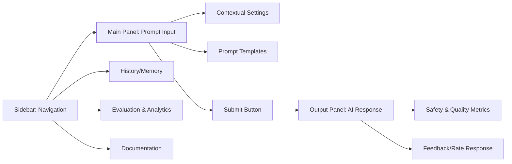

# Meta-Prompt Engineering Framework - UI Design

## Modern, Aesthetic UI Concept

## UI Features

- **Sidebar Navigation**: Quick access to prompts, history, evaluation, and docs
- **Main Panel**: Clean, focused area for prompt input and context settings
- **Prompt Templates**: Easily select or customize prompt templates
- **Output Panel**: Beautifully formatted AI responses with safety and quality scores
- **Feedback**: Users can rate and provide feedback for continuous improvement
- **Analytics**: Visualize performance, safety, and usage metrics
- **Dark/Light Mode**: Modern, accessible design

> The UI is designed for clarity, speed, and a delightful user experience. 